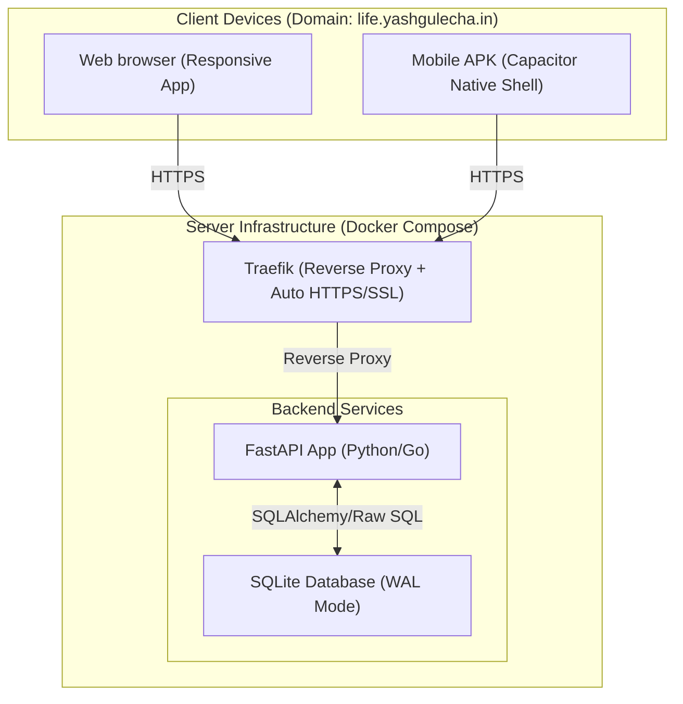

# Life OS Proposal: "Pulse" — The Personal Life Engine

A lightweight, command-driven, dockerized management engine for tracking and optimizing your health, academics, finances, relationships, and knowledge, accessible under `life.yashgulecha.in` via Web and a custom Android APK.

---

## 1. Core Philosophy: The "Frictionless Engine"

Most Life OS frameworks (like complex Notion templates or enterprise-grade ERPs) fail because they demand high-maintenance data entry. "Pulse" is designed as a **Management Engine** rather than a database repository:

*   **Command-Line Interface (CLI) Input**: A prominent, smart command bar at the top of the app (accessible via a global shortcut `Cmd+K` / `Ctrl+K` or a mobile tap). You type a command like `/spent 500 on dinner` or `/health weight 72`, and the engine parses, executes, and updates your stats automatically.
*   **Tap-to-Log Widgets**: Custom widgets with smart presets (e.g., +1 glass of water, -1hr sleep).
*   **Weekly / Monthly Check-ins**: Instead of micro-managing every minute, the engine prompts you for a 5-minute reflection at the end of the week.
*   **Dashboard-First View**: Focuses on showing you *an overview of your life* (KPIs, warnings, and priorities) rather than lists of raw data.

---

## 2. System Architecture

---

## 3. Technology Stack

We select tools that prioritize performance, low memory footprint, speed of development, and seamless compilation to mobile:

| Layer | Technology | Rationale |
| :--- | :--- | :--- |
| **Frontend Framework** | **Vite + React (TypeScript)** | Blazing fast, highly structured, minimal build size, and integrates perfectly with mobile wrappers. |
| **Mobile Compiler** | **Ionic Capacitor** | Turns the React web application directly into a native Android APK with a single command. Zero code duplication. |
| **Styling** | **Vanilla CSS + CSS Modules** | Lightweight styling with zero CSS engine overhead, maintaining rich aesthetics and responsive design. |
| **Backend API** | **FastAPI (Python)** | Extremely fast asynchronous execution, automatic OpenAPI/Swagger documentation, low memory overhead, and allows easy expansion into AI/NLP capabilities for smart parsing. |
| **Database** | **SQLite (WAL Mode)** | Zero-overhead, single-file serverless database. When run in WAL (Write-Ahead Logging) mode, it handles concurrent reads/writes with incredible speed, making backups a breeze. |
| **Authentication** | **JWT with HttpOnly Cookies** | Secure, stateless authentication with password hashing (bcrypt) and local session management. |
| **Reverse Proxy** | **Traefik** | Existing server-wide reverse proxy. Automatically routes traffic from `life.yashgulecha.in` using Docker labels, and manages SSL/TLS certificates via Let's Encrypt. |
| **Containerization** | **Docker & Docker Compose** | Ensures portability. The entire stack can be spun up on any server with a single command: `docker compose up -d`. |

---

## 4. Key Feature Modules

### ⚡ Smart Command Bar (Rapid Capture)
*   A single, conversational text input field.
*   Uses a simple router to process commands:
    *   `/todo [task] [due_date]` $\rightarrow$ Adds to academics/general tasks.
    *   `/spent [amount] [category] [description]` $\rightarrow$ Logs a financial transaction.
    *   `/health [metric] [value]` (e.g., `/health weight 74.5`, `/health water 3`) $\rightarrow$ Logs to physical telemetry.
    *   `/note [text]` $\rightarrow$ Quick scratchpad entry.
    *   `/rel [name] [short update]` $\rightarrow$ Logs interaction with a contact.

### 🍎 Health & Vitals Dashboard
*   **Weight & Water Trackers**: Visual progress rings.
*   **Sleep & Energy Level**: Simple correlation graph (hours of sleep vs. morning energy rating).
*   **Activity Logging**: One-tap toggles for key habits (Workout, Meditate, Read).

### 🎓 Academic Engine
*   **Course Tracker**: Active classes, grades, and attendance.
*   **Assessment Tracker**: Weighted assignment calculator (so you know exactly what grade you need on your final exam).
*   **Countdown Timers**: Visual widgets for exam dates and project deadlines.

### 💰 Finance Hub (Passive Oversight)
*   **Net Worth Snapshot**: A single chart tracking Cash, Investments, and Liabilities.
*   **Budget Envelope System**: Tracks remaining daily/weekly allowance, updated via `/spent` command.
*   **Recurring Bills Tracker**: Alerts for subscription renewals.

### 🗺️ Bucket List & Goals
*   **Short-Term Focus**: 3-5 major milestones for the current quarter.
*   **Life Goals**: Category-based list (Travel, Career, Skill, Experiences).
*   **Progress Indicators**: Status updates (Planned, In Progress, Achieved).

### 📝 Notes & Knowledge Wiki (Zettelkasten-Lite)
*   **Daily Scratchpad**: Markdown notes compiled daily.
*   **Tagging System**: `#finance`, `#academic`, `#philosophy`.
*   **Interlinking**: Ability to reference other pages using simple wiki syntax `[[Note Title]]`.

### 👥 Personal CRM (Relations)
*   **Inner Circle Tracker**: A list of key relationships (family, close friends, mentors).
*   **Last Contact Indicator**: Shows a progress bar of days passed since the last conversation.
*   **Auto-Reminders**: Highlights contacts you haven't spoken to in over a user-defined threshold (e.g., 14 days).

---

## 5. Security & Authentication

Since this app holds sensitive personal, financial, and health information:
1.  **Strict Auth Shield**: Access is completely blocked behind a secure login screen. No public endpoints.
2.  **Stateless JWT**: Signed JSON Web Tokens stored in secure, `HttpOnly`, `SameSite=Strict` cookies to prevent XSS and CSRF attacks.
3.  **Local Encryption Option**: Sensitive data fields (like financial credentials or academic IDs) can be encrypted in SQLite using AES-256.
4.  **TOTP 2FA (Optional but recommended)**: Standard authenticator app integration (Google Authenticator/Duo) for login protection.

---

## 6. Dockerization Strategy

The application will be configured to run inside a multi-container Docker Compose network.

### Proposed Container Topology:
1.  **`traefik`**: System-wide container routing SSL traffic from `life.yashgulecha.in` to our services.
2.  **`backend-api`**: Runs the FastAPI app, communicates with local SQLite database file (mounted as a volume on the host for easy backups).
3.  **`frontend-app`**: Houses the static Vite build, served internally by Nginx.

---

## 7. Next Steps & Customization

Before we write code, let's align on your preferences:

1.  **Backend Language**: Do you prefer **FastAPI (Python)** (highly expandable with scripts/AI utilities) or **Go / Express (Node.js)**?
2.  **Database**: Is **SQLite** (lightweight, zero maintenance, backup-friendly file) sufficient, or do you want a full **PostgreSQL** instance?
3.  **Self-Hosting & Reverse Proxy**: Do you already have a server set up with Docker/Docker Compose and DNS pointed, or will you need setup scripts for that?
